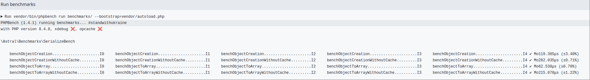
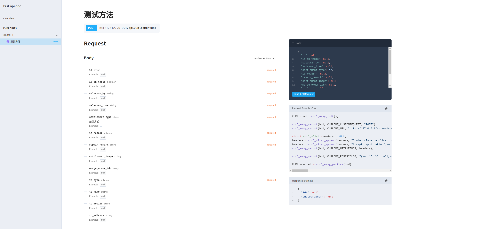

[](https://packagist.org/packages/astral/php-serialize)
[](https://github.com/astral-data/php-serialize/actions/workflows/test.yml)
[](https://github.com/astral-data/php-serialize/actions/workflows/phpstan.yml)

# Languages

- [Complete documen-English](https://astrals-organization.gitbook.io/php-serialize/php-serialize-en)
- [完整文档-中文](https://astrals-organization.gitbook.io/php-serialize)

# php-serialize

**php-serialize** is a powerful attribute-based serialization library for PHP (requires **PHP ≥ 8.1**).  
It allows you to map objects to arrays/JSON and **automatically generate OpenAPI documentation** based on the same attributes.

> 🚀 Unified solution for API data serialization and documentation generation.

## ✨ Features

- 🏷️ Property aliasing with
- 🔄 Automatic type casting (e.g. `DateTime ↔ string`)
- 🔁 Deep object nesting support
- ❌ Skip/exclude fields with
- 🧩 Recursive DTO serialization
- 🧬 **Auto-generate OpenAPI schema** using object definitions
- ⚙️ Framework-agnostic — works with Laravel, Symfony, etc.

## Benchmark



## Quick Start

### Installation

Install using Composer:

```bash
composer require astral/php-serialize
```

### Basic Usage

```php
use Astral\Serialize\Serialize;

class User extends Serialize {
    public string $name,
    public int $age
}

// Create object from array
$user = User::from([
    'name' => 'John Doe',
    'age' => 30
]);

// Access object properties
echo $user->name;  // Output: John Doe
echo $user->age;   // Output: 30

// Convert to array
$userArray = $user->toArray();
// $userArray contents:
// [
//     'name' => 'John Doe',
//     'age' => 30
// ]
```

#### Other Features

1. **Immutability**: Read-only properties cannot be modified after construction

```php
use Astral\Serialize\Serialize;

class User extends Serialize {
    public function __construct(
        public readonly string $name,
        public readonly int $age
    ) {}
}

$user = User::from([
    'name' => 'John Doe',
    'age' => 30
]);

try {
    $user->name = 'Jane Doe';  // Compile-time error: cannot modify read-only property
} catch (Error $e) {
    echo "Read-only properties cannot be reassigned";
}
```

2. **Type-Safe Initialization**

```php
$user = User::from([
    'name' => 123,       // Integer will be converted to string
    'age' => '35'        // String will be converted to integer
]);

echo $user->name;  // Output: "123"
echo $user->age;   // Output: 35
```

3. **Constructor Initialization**

```php
use Astral\Serialize\Serialize;

class User extends Serialize {
    public function __construct(
        public readonly string $name,
        public readonly int $age
    ) {
        // Can add additional validation or processing logic in the constructor
        if (strlen($name) < 2) {
            throw new \InvalidArgumentException('Name is too short');
        }
    }
}
```

## Auto Create OpenApi Doc

### Creating Request

```php
use Astral\Serialize\Serialize;

class UserAddRequest extends Serialize {
    public string $name;
    public int $id;
}

class UserDetailRequest extends Serialize {
    public int $id;
}
```

### Creating Response
```php
use Astral\Serialize\Serialize;

class UserDto extends Serialize {
    public string $name,
    public int $id;
}
```

### Creating Controller
```php
use Astral\Serialize\Serialize;
use Astral\Serialize\OpenApi\Enum\MethodEnum;

#[\Astral\Serialize\OpenApi\Annotations\Tag('User Module Management')]
class UserController {

    #[\Astral\Serialize\OpenApi\Annotations\Summary('Create User')]
    #[\Astral\Serialize\OpenApi\Annotations\Route('/user/create')]
    #[\Astral\Serialize\OpenApi\Annotations\RequestBody(UserAddRequest::class)]
     #[\Astral\Serialize\OpenApi\Annotations\Response(UserDto::class)]
    public function create() 
    {
        return new UserDto(); 
    }
    
    #[\Astral\Serialize\OpenApi\Annotations\Summary('User Detail')]
    #[\Astral\Serialize\OpenApi\Annotations\Route(route:'/user/detail', method: MethodEnum::GET)]
    public function detail(UserDetailRequest $request): UserDto  
    {
        return new UserDto();
    }
}
```
### Starting the Service

#### Docker Deployment

Navigate to the project root directory first:

```shell
docker run  -v $PWD/vendor/astral/php-serialize/src/OpenApi/Frankenphp/Caddyfile:/etc/frankenphp/Caddyfile -v $PWD:/app -p 8089:80 dunglas/frankenphp
```
Access `http://127.0.0.1:8089/docs` to view the documentation.


