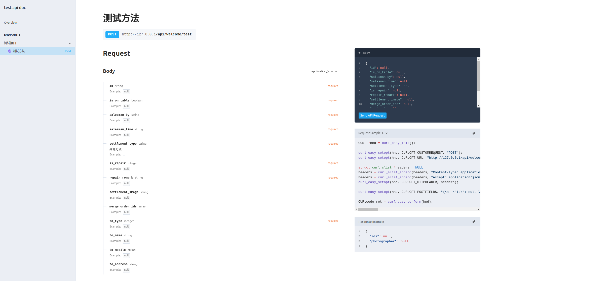

## 创建Request

```php
use Astral\Serialize\Serialize;

class UserAddRequest extends Serialize {
    public string $name;
    public int $id;
}

class UserDetailRequest extends Serialize {
    public int $id;
}
```

## 创建Repose
```php
use Astral\Serialize\Serialize;

class UserDto extends Serialize {
    public string $name,
    public int $id;
}
```

## 创建Controller
```php
use Astral\Serialize\Serialize;
use Astral\Serialize\OpenApi\Enum\MethodEnum;

#[\Astral\Serialize\OpenApi\Annotations\Tag('用户模块管理')]
class UserController {

    #[\Astral\Serialize\OpenApi\Annotations\Summary('创建用户')]
    #[\Astral\Serialize\OpenApi\Annotations\Route('/user/create')]
    #[\Astral\Serialize\OpenApi\Annotations\RequestBody(UserAddRequest::class)]
    #[\Astral\Serialize\OpenApi\Annotations\Response(UserDto::class)]
    public function create() 
    {
        return new UserDto(); 
    }
    
    #[\Astral\Serialize\OpenApi\Annotations\Summary('用户详情')]
    #[\Astral\Serialize\OpenApi\Annotations\Route(route:'/user/detail', method: MethodEnum::GET)]
    public function detail(UserDetailRequest $request): UserDto  
    {
        return new UserDto();
    }
}
```
## 启动服务

### Docker启动

进入项目根目录

```shell
docker run  -v $PWD/vendor/astral/php-serialize/src/OpenApi/Frankenphp/Caddyfile:/etc/frankenphp/Caddyfile -v $PWD:/app -p 8089:80 dunglas/frankenphp
```
访问 `http://127.0.0.1:8089/docs` 查看文档



### Docker启动

先进入项目根目录

```shell
docker run  -v $PWD/vendor/astral/php-serialize/src/OpenApi/Frankenphp/Caddyfile:/etc/frankenphp/Caddyfile -v $PWD:/app -p 8089:80 dunglas/frankenphp
```

访问  `http://127.0.0.1:8089` 展示OpenApi JSON文档

访问 `http://127.0.0.1:8089/docs` 展示UI文档

